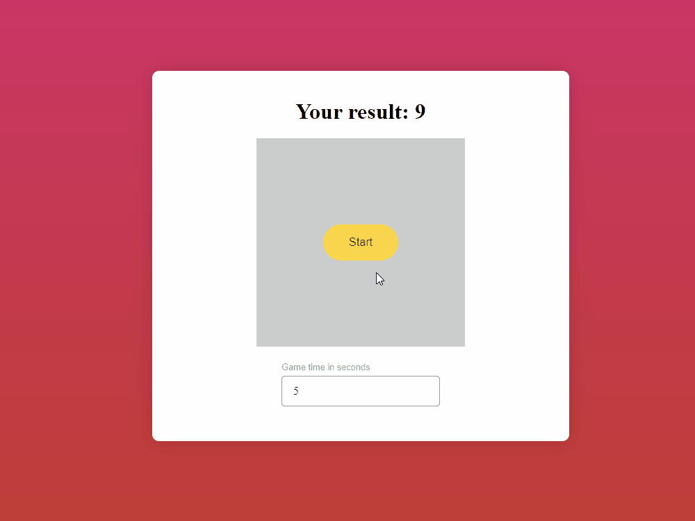

# About this project

This is a simple browser game on JavaScript. The goal is to score as many points as possible in a period of time. You can choose the duration of the game and after its completion you will see the number of points scored.

## Demo

## Run Project Locally

1. Clone or fork this repository.
2. Open file index.html in browser.

## Technologies Used

- JavaScript
- ES6 +
- CSS3
- HTML5
